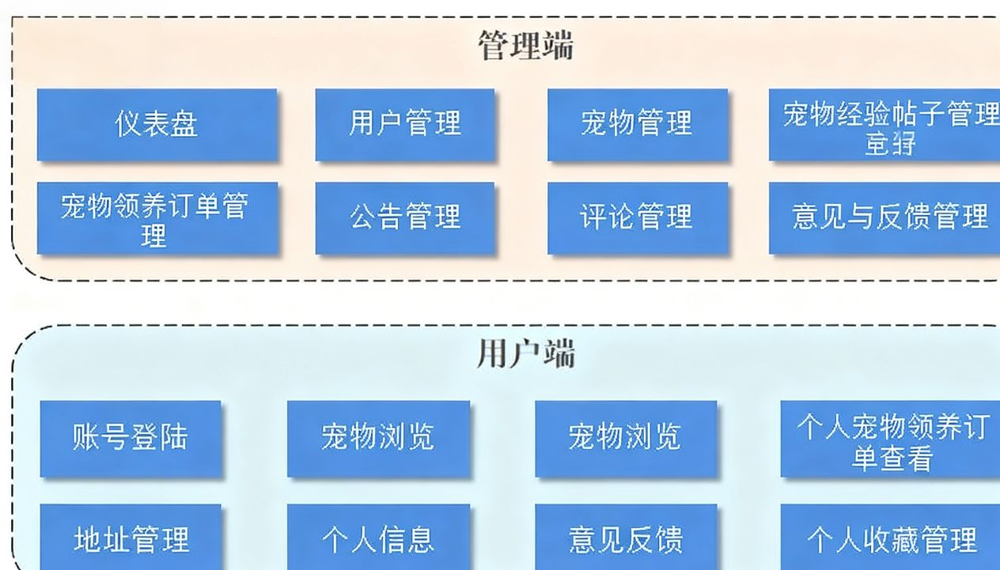

<h1>宠物领养系统</h1>
<h2>项目介绍</h2>
本项目（宠物领养系统）是为宠物救助站、动物保护机构定制的公益性质管理系统，通过数字化手段规范领养流程、提升救助效率，同时为爱心用户提供便捷的宠物领养渠道，实现 “救助 - 审核 - 领养” 全流程线上化。
<h2>功能架构图</h2>

<h3>(1). 管理端功能​</h3>
管理员登录/退出，用户信息管理，宠物类别管理，宠物信息管理（含健康状况、年龄、品种等），宠物领养订单管理（待审核、已通过），宠物经验帖子审核，系统公告管理，用户评论管理，意见与反馈处理，领养数据统计（如月度领养量、品类占比）。​
<h3>(2). 用户端功能​</h3>
账号登录/注册，微信快捷登录，个人收件地址管理（默认地址设置、多地址切换），个人领养订单查询（申请中、审核通过、审核不通过），宠物详情查询（含健康报告、领养要求），宠物收藏管理（添加 / 取消收藏、查看收藏列表），领养申请提交（上传个人资质材料），领养进度跟踪，分类及宠物浏览（按品类、年龄、领养难度筛选），意见反馈提交，宠物经验帖子浏览。
<h2>技术选型</h2>
本系统采用的开发语言是：
● 前端：JavaScript 、 CSS 、HTML、Vue.js（2）
● 后端：Java
采用的开发框架 ：
● 前端：Vue.js（2） + ElementUI（UI组件库）+ Axios （网络请求库）
● 后端：SpringBoot + Mybatis + MybatisPlus + SpringMVC
数据库：MySQL
给个总结，前端基于Vue2+ElementUI搭建，后端基于SpringBoot框架搭建，数据库采用的是MySQL框架。
